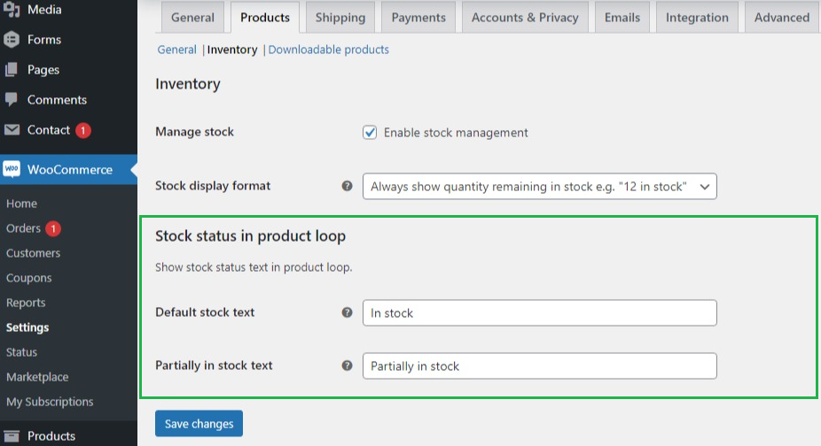
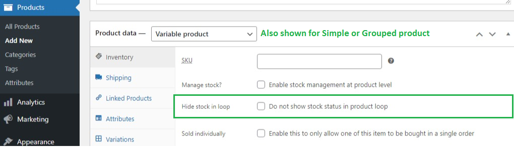

## Introduction

By default, WooCommerce doesn't show stock status of any product in product loop* (shop and category pages, cross-sells and upsells lists). This absence of stock status results in poor user experience (UX) when user reaches a product detail page to buy it via product loop (e.g. shop page) and finds out that either product is out-of-stock or doesn't have enough quantity in stock. To avoid this poor UX, you can use WooCommerce Stock Status in Product Loop plugin to show stock status of each product in product loop.

* Product loop is a traversal of a set of products. WC uses it to render products on shop, category pages and in cross-sells, upsells lists.

## Stock status and text for product loop

### Grouped or Variable product

Stock status will be:
- **out-of-stock**: no child product* is visible or in stock
- **in-stock**: all visible child products are in stock
- **partially-in-stock**: not all visible child products are in stock

For partially-in-stock status, you can set the text to show in product loop in [partially in stock text](#partially-in-stock-text) field. For other statuses, text is generated by WooCommerce.

* The child products of a Grouped product are its linked products. The child products of a Variable product are its variations.

### Simple product

Status and text are generated by WooCommerce. There are two special cases when WooCommerce generates empty text. To handle them, see [Default stock text](#default-stock-text)

## Installation

### Minimum Requirements

- PHP 5.6 or greater is recommended
- Wordpress 5.0 or greater
- Woocommerce 4.1 or greater

### Manual installation

Manual installation method requires downloading this plugin and uploading it to your web server via your favorite FTP application. The WordPress codex contains [instructions on how to do this here](https://wordpress.org/support/article/managing-plugins/#manual-plugin-installation).

### Updating

Please use [Evneto Market WordPress](https://envato.com/market-plugin/) plugin to update the plugin. If you need help in using this plugin, please read [Update themes automatically using Envato Market plugin](https://seventhqueen.com/support/general/article/update-themes-automatically-using-envato-market-plugin).

## Configuration

Plugin provides global and product level settings.

### Global Level

- There are two ways to open it:
  1. Open "WooCommerce Settings" page in Dashboard (Dashboard -> WooCommerce -> Settings). Switch to "Products" tab and then open "Inventory" sub-tab and scroll down to reach "Stock status in product loop".
  2. Open "Plugins" page in Dashboard (Dashboard -> Plugins). Scroll down to reach "WooCommerce Stock Status in Product Loop" entry. Click "Settings" link in this entry to to reach "Stock status in product loop".

#### Default stock text

This text is shown only for Simple product. Default value is "In stock". It is shown when WC generates empty stock text which can happen in two cases:
  - Stock is not being managed for the product and stock status is set to "In stock".
  - Stock is being managed for the product and backorders are allowed without any indication for the user when product goes on backorder.

If products are being rendered in a Grid layout in product loop, these two cases may be problematic for the vertical alignment of grid items. Technically speaking, this vertical alignment issue will only happen when height of grid item is "auto" and CSS layout for grid is not "Flexible Box". To make sure that all grid items have the same height, this text (default stock text) is shown for these two cases.

#### Partially in stock text

This text is shown only for Grouped and Variable products. It is shown when not all visible child products are in stock. Default value is "Partially in stock".

### Product Level

- Open "Product List" page in Dashboard (Dashboard -> Products).
- Open the product you want to edit from the product list.
- Scroll down to data panels and open "Inventory" data panel.

#### Hide stock in loop

If enabled, stock status will not be shown in product loop. This field is not shown for an "External" product.

## Usage

- **To Change default global settings**
  - Open global settings as descirbed in [configuration](#global-level)
  - Make and save changes

- **To hide stock text for a product in product loop**
  - Open product settings as descirbed in [configuration](#product-level)
  - Chech the [Hide stock in loop](#hide-stock-in-loop) checkbox and save product

## Changelog

**2021-11-17 - Version 1.0.0**
  - Initial Release

